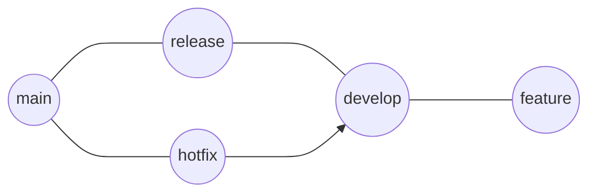

# API de Filas de Mensagens com NestJS

Esta é uma API construída com NestJS para simular o processamento de mensagens, incluindo funcionalidades como retentativas, histórico de processamento e métricas Prometheus.

## Sumário

- [Tecnologias Utilizadas](#tecnologias-utilizadas)
- [Pré-requisitos](#pré-requisitos)
- [Configuração do Ambiente](#configuração-do-ambiente)
  - [Variáveis de Ambiente](#variáveis-de-ambiente)
- [Como Rodar a Aplicação](#como-rodar-a-aplicação)
  - [Usando Yarn (Desenvolvimento)](#usando-yarn-desenvolvimento)
  - [Usando Docker](#usando-docker)
- [Testes](#testes)
  - [Testes Unitários/Integração](#testes-unitáriosintegração)
  - [Testes End-to-End (e2e)](#testes-end-to-end-e2e)
  - [Cobertura de Testes](#cobertura-de-testes)
- [Linting e Formatação](#linting-e-formatação)
- [Documentação da API (Swagger)](#documentação-da-api-swagger)
- [Métricas (Prometheus)](#métricas-prometheus)
- [Git Flow (Fluxo de Desenvolvimento)](#git-flow-fluxo-de-desenvolvimento)
- [Estrutura do Projeto](#estrutura-do-projeto)

## Tecnologias Utilizadas

- [NestJS (Node.js framework)](https://nestjs.com/)
- [TypeScript](https://www.typescriptlang.org/)
- [TypeORM](https://typeorm.io/) com [SQLite](https://www.sqlite.org/index.html) para persistência do histórico
- [Docker](https://www.docker.com/) & [Docker Compose](https://docs.docker.com/compose/)
- [Yarn](https://yarnpkg.com/) (Gerenciador de Pacotes)
- [Swagger (OpenAPI)](https://swagger.io/) para documentação da API
- [Prometheus](https://prometheus.io/) para monitoramento de métricas
- [Pino (Logger)](https://getpino.io/) com `nestjs-pino`
- [Jest](https://jestjs.io/) para testes
- [ESLint](https://eslint.org/) e [Prettier](https://prettier.io/) para linting e formatação de código
- [Husky](https://typicode.github.io/husky/) & [lint-staged](https://github.com/okonet/lint-staged) para pre-commit hooks

## Pré-requisitos

- [Node.js](https://nodejs.org/) (versão >= 18.x recomendada)
- [Yarn](https://yarnpkg.com/getting-started/install) (versão >= 1.22.x ou Yarn 2+)
- [Docker](https://docs.docker.com/get-docker/) e [Docker Compose](https://docs.docker.com/compose/install/) (para execução via Docker)
- [Git](https://git-scm.com/)

## Configuração do Ambiente

1.  **Clone o repositório:**
    ```bash
    git clone [<URL_DO_REPOSITORIO>](https://github.com/DedeOli21/api-message-queue)
    cd api-message-queue
    ```

2.  **Instale as dependências (usando Yarn):**
    ```bash
    yarn install
    ```

### Variáveis de Ambiente

A aplicação pode ser configurada através de variáveis de ambiente. A porta padrão é `3000`.

-   `PORT`: Porta em que a aplicação será executada. (Ex: `PORT=3001`)

Crie um arquivo `.env` na raiz do projeto se precisar sobrescrever as configurações padrão (embora este projeto atualmente não leia um `.env` explicitamente, a variável `PORT` é lida via `process.env.PORT`).

## Como Rodar a Aplicação

### Usando Yarn (Desenvolvimento)

1.  **Iniciar em modo de desenvolvimento (com watch):**
    ```bash
    yarn start:dev
    ```
    A aplicação estará disponível em `http://localhost:3000` (ou na porta configurada).

2.  **Outros scripts úteis com Yarn:**
    -   `yarn start`: Inicia a aplicação (sem watch, usando a build de `dist`).
    -   `yarn build`: Compila o projeto TypeScript para JavaScript (saída em `dist/`).
    -   `yarn start:prod`: Inicia a aplicação em modo de produção (requer `yarn build` antes).
    -   `yarn start:debug`: Inicia em modo de desenvolvimento com debugging habilitado.

### Usando Docker

O projeto inclui um `Dockerfile` e um `docker-compose.yml` para facilitar a execução em contêineres.

1.  **Construir a imagem e iniciar os contêineres (desenvolvimento):**
    Este comando usa o `Dockerfile.dev` que monta o volume do código-fonte para live-reloading.
    ```bash
    docker-compose -f docker-compose.yml up --build app-dev
    ```
    A aplicação estará disponível em `http://localhost:3000` (ou na porta mapeada no `docker-compose.yml`).

2.  **Construir a imagem e iniciar os contêineres (produção):**
    Este comando usa o `Dockerfile` otimizado para produção.
    ```bash
    docker-compose up --build app
    ```

3.  **Parar os contêineres:**
    ```bash
    docker-compose down
    ```

O `docker-compose.yml` também define um serviço `prometheus` que pode ser iniciado para coletar métricas da aplicação.

## Testes

### Testes Unitários/Integração

Os testes são escritos com Jest e podem ser encontrados na pasta `test/` ou ao lado dos arquivos de origem com a extensão `.spec.ts`.

1.  **Rodar todos os testes:**
    ```bash
    yarn test
    ```

2.  **Rodar testes em modo watch:**
    ```bash
    yarn test:watch
    ```

### Testes End-to-End (e2e)

Os testes e2e também usam Jest e estão configurados em `test/jest-e2e.json`.

1.  **Rodar testes e2e:**
    ```bash
    yarn test:e2e
    ```
    Certifique-se de que a aplicação esteja rodando (localmente ou via Docker) antes de executar os testes e2e, ou ajuste-os para iniciar a aplicação se necessário.

### Cobertura de Testes

Para gerar um relatório de cobertura de testes:

```bash
yarn test:cov
```
O relatório será gerado na pasta `coverage/`.

## Linting e Formatação

-   **Verificar e corrigir o lint (ESLint):**
    ```bash
    yarn lint
    ```

-   **Formatar o código (Prettier):**
    ```bash
    yarn format
    ```

-   **Verificar tipos (TypeScript):**
    ```bash
    yarn typecheck
    ```

Os hooks de pre-commit (Husky + lint-staged) estão configurados para rodar o lint em arquivos staged antes de cada commit.

## Documentação da API (Swagger)

Após iniciar a aplicação, a documentação da API (Swagger UI) estará disponível em:
`http://localhost:3000/api/docs`

## Métricas (Prometheus)

A aplicação expõe métricas no endpoint `/metrics` para serem coletadas pelo Prometheus.
Se estiver usando o `docker-compose.yml` fornecido, o Prometheus estará configurado para coletar essas métricas e pode ser acessado em `http://localhost:9090`.

## Git Flow (Fluxo de Desenvolvimento)

Este projeto segue um fluxo similar ao Git Flow:



**Branches Principais:**
-   `main`: Contém o código de produção estável. Tags são criadas a partir desta branch para cada release.
-   `develop`: Branch de integração para features. É a base para novas features e reflete o estado mais recente do desenvolvimento.

**Branches de Suporte:**
-   `feature/*` ou `feat/*`: Criadas a partir de `develop` para desenvolver novas funcionalidades. São mescladas de volta em `develop`.
    -   Exemplo: `feature/user-authentication`, `feat/new-message-processor`
-   `release/*`: Criadas a partir de `develop` quando uma versão está pronta para ser lançada. Permite a preparação final da release (testes, pequenas correções, atualização de documentação). Após a finalização, é mesclada em `main` (com tag) e também em `develop` (para incorporar quaisquer correções feitas na release).
    -   Exemplo: `release/v1.0.0`
-   `hotfix/*`: Criadas a partir de `main` para corrigir bugs críticos em produção. Após a correção, são mescladas de volta em `main` (com nova tag de patch) e também em `develop` (para garantir que a correção seja incorporada no desenvolvimento futuro).
    -   Exemplo: `hotfix/fix-critical-bug-123`

**Resumo Visual (Fluxo):**
```
main    <------ release <------ develop <------ feature
^      /           /           /
|     /           /           /
hotfix -----------/----------/

```
## Estrutura do Projeto

O projeto segue uma arquitetura em camadas, inspirada na Clean Architecture:

-   `src/`
    -   `application/`: Contém os casos de uso da aplicação e serviços de aplicação.
        -   `services/`: Lógica de domínio/aplicação que pode ser compartilhada entre casos de uso.
        -   `usecases/`: Casos de uso específicos da aplicação.
    -   `config/`: Arquivos de configuração (ex: `datasource.ts`).
    -   `domain/`: Entidades de domínio, interfaces de repositório e lógica de domínio pura.
        -   `entities/`: Classes que representam os objetos de domínio.
        -   `interfaces/`: Contratos para os repositórios.
    -   `infra/`: Implementações concretas de interfaces da camada de domínio, como repositórios e módulos de banco de dados.
        -   `database/`: Configuração e módulos relacionados ao banco de dados (TypeORM).
        -   `repositories/`: Implementações dos repositórios.
    -   `main.ts`: Ponto de entrada da aplicação NestJS.
    -   `app.module.ts`: Módulo raiz da aplicação.
    -   `metrics/`: Configuração e definição de métricas Prometheus.
    -   `migrations/`: Migrations de banco de dados TypeORM.
    -   `presentation/`: Camada responsável pela interação com o "mundo externo" (HTTP controllers, DTOs).
        -   `controllers/`: Controladores NestJS que lidam com requisições HTTP.
            -   `dto/`: Data Transfer Objects usados pelos controllers.
    -   `shared/`: Código compartilhado entre diferentes camadas (ex: enums, helpers).
    -   `swagger.ts`: Configuração do Swagger.
-   `test/`: Testes e2e e de integração.

---

Sinta-se à vontade para contribuir ou reportar issues!
